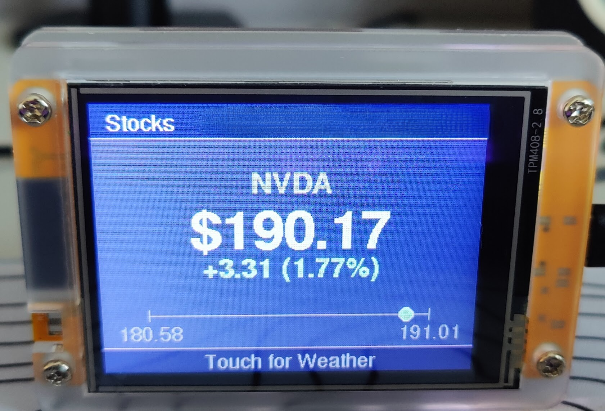

# ESP32 Web GUI - Smart Stock Ticker & Weather Dashboards

This is a comprehensive, WiFi-enabled, touch-screen smart ticker for stocks, weather, and time. It's built for the "Cheap Yellow Display" (CYD) ESP32 board and is controlled by a modern, responsive web interface that includes Over-the-Air (OTA) update capabilities and persistence. In my case, this has been built for the TENSTAR ESP32 variant, readily found on the likes of AliExpress. (ILI9342 / ILI9341 with TOUCH XPT2046)

The device automatically rotates through user-defined lists of stocks and weather locations. The screen can be tapped at any time to toggle between modes.





## Features

* **Three-Mode Display:** Rotates between three pages:
  * **Stocks:** Displays the ticker, current price, day's change, and a High/Low/Current price bar.
  * **Weather:** Shows the current temperature, a description, and a 3-day forecast (day, description, high/low).
* **Touch Interface:** Tap the screen to toggle between the Stock and Weather pages.
* **Persistence:** All user settings (rotation lists, list order, timer interval, WiFi credentials) are  **saved to the ESP32's flash memory (LittleFS)** . They are automatically reloaded on reboot.
* **mDNS Address:** Access the Web GUI from any device on your network at  **`http://esp32-ticker.local`** .
* **Full Web Control Panel:** A multi-tabbed web interface for full control:
  * **One-Off Fetch:** Instantly fetch a specific stock or weather location.
  * **Rotation:**
    * Add/remove items from the Stock and Weather lists.
    * **Drag-and-Drop** to re-order lists.
    * **Configurable Timer:** Set the page rotation interval (10-sec minimum).
    * **Restore Defaults:** A "factory reset" button to restore the lists from your `secrets.cpp` file.
  * **Network Config:** Change the WiFi network. The device saves the new credentials to flash.
  * **OTA (Over the air) Updates:** Upload new `firmware.bin` files directly from your browser.
* **Smart APIs:**
  * **Stocks:** Uses the Finnhub API for real-time quotes (High, Low, Current).
  * **Weather:** Uses the Open-Meteo API, including the Geocoding API to find any location by name.
* **Private Secrets:** All personal information (API keys, WiFi credentials, default lists) is stored in the `src/secrets.cpp` file

## How It Works: Project Architecture

This project runs entirely on the ESP32, which acts as both a web server and a data-fetching client.

1. **ESP32 as a Web Server:** The device runs an `AsyncWebServer`. When you visit `http://esp32-ticker.local`, you are loading the HTML/CSS/JavaScript  *directly from the ESP32's memory* .
2. **Web GUI Control:** When you add a new stock in the web GUI, your browser sends an API call (e.g., `/add_stock?ticker=TSLA`) back to the ESP32. The server code in `web_server.cpp` receives this, updates the list in memory, and **saves the new list to a JSON file on the flash** using LittleFS.
3. **ESP32 as a Client:** The device's main loop in `main.cpp` is responsible for displaying data. When it's time to fetch an update (e.g., for "NVDA"), the ESP32 acts as a client. It sends its *own* HTTP request out to the internet to the F**innhub API,** gets the stock price, and then draws it on the screen.
4. **Weather Geocoding:** When fetching weather for "London", the device *first* sends a request to the **Open-Meteo Geocoding API** to get the latitude and longitude. Once it has those, it sends a *second* request to the **Open-Meteo Forecast API** to get the current weather and 3-day forecast.
5. **OTA Updates:** When you upload a `firmware.bin` file, the ESP32 web server receives the binary data and writes it to its own inactive flash partition. It then reboots itself to load the new firmware.

## Hardware Requirements

* **Board:** ESP32 "Cheap Yellow Display" (CYD)
* **Display:** ILI9341
* **Touch Controller:** XPT2046

## Software Requirements

* [Visual Studio Code](https://code.visualstudio.com/ "null")
* [PlatformIO IDE Extension](https://platformio.org/platformio-ide "null")

## 1. Project Setup (For a New User)

This guide will get you from a fresh download to a running device.

### Step 1: Clone or Download the Code

Download the `.zip` or clone this repository to your computer.

### Step 2: Configure `platformio.ini`

Open the project folder in VS Code. PlatformIO may ask you to trust the project. Open the `platformio.ini` file at the root of the project and replace its contents with the block below. This ensures you have the correct board, settings, and all required libraries.

```
[env:esp32dev]
platform = espressif32
board = esp32dev
framework = arduino
monitor_speed = 115200

lib_deps =
 https://github.com/me-no-dev/ESPAsyncWebServer.git
 bodmer/TFT_eSPI@^2.5.43
 bblanchon/ArduinoJson@^6.21.2
 paulstoffregen/XPT2046_Touchscreen
 ESPmDNS
```

*(Note: `LITTLEFS` is part of the ESP32 core and does not need to be in `lib_deps`)*

### Step 3: Configure `TFT_eSPI` Library (CRITICAL)

This is the most important step. The `TFT_eSPI` library is not configured in the project files, it's configured in your computer's library folder.

1. **Find the Library:** After building/compiling once, PlatformIO will download the libraries. Find the `User_Setup.h` file. A typical path is:
   `C:\Users\<YourUser>\.platformio\libdeps\<your_project>\TFT_eSPI\User_Setup.h`
   (You can also find it in your project's `.pio` folder under `libdeps`)
2. **Edit `User_Setup.h`:** Open this file. **Delete everything in it** and replace it with the exact configuration below. This config is built specifically for this CYD board and to work with our touch controller (by using `HSPI` for the TFT, leaving `VSPI` free for touch).
   ```
   // =========================================================================
   //
   //    ESP32 "Cheap Yellow Display" (CYD) ILI9341 + XPT2046
   //
   // =========================================================================

   #define ILI9341_DRIVER

   // TFT Pins
   #define TFT_MISO 12
   #define TFT_MOSI 13
   #define TFT_SCLK 14
   #define TFT_CS   15  // Chip select
   #define TFT_DC    2  // Data Command
   #define TFT_RST  -1  // Or connect to EN

   // Backlight Pin
   #define TFT_BL 21
   #define TFT_BACKLIGHT_ON HIGH // This is the crucial fix for black screens

   // ### IMPORTANT: Force TFT to use HSPI bus ###
   // This leaves the default VSPI bus (SPI object) free for the
   // XPT2046 touch controller, which is on different pins.
   #define USE_HSPI_PORT

   // Fonts
   #define LOAD_GLCD
   #define LOAD_FONT2
   #define LOAD_FONT4
   #define LOAD_FONT6
   #define LOAD_FONT7
   #define LOAD_FONT8
   #define LOAD_GFXFF
   #define SMOOTH_FONT

   // SPI Settings
   #define SPI_FREQUENCY        40000000
   #define SPI_READ_FREQUENCY   20000000

   // NOTE: We do NOT define TOUCH_CS here.
   // Touch is handled manually in the main sketch on the VSPI bus.
   ```

### Step 4: Calibrate Touch Screen (Recommended)

Every touch screen is slightly different. The default values in this project might not work perfectly for you. Follow these steps to get your screen's unique calibration values.

1. **Open `src/main.cpp`** .
2. **Temporarily replace** the *entire* contents of `main.cpp` with the minimal calibration sketch below.
3. **Upload** this new sketch (hold `BOOT` and click "Upload" in PlatformIO).
4. Open the **"Monitor"** in PlatformIO (set baud rate to 115200).
5. Follow the instructions in the Serial Monitor:
   * **Press firmly on the TOP-LEFT corner.** Note the smallest `X` and `Y` values you see. (e.g., `X = 265`, `Y = 280`).
   * **Press firmly on the BOTTOM-RIGHT corner.** Note the largest `X` and `Y` values. (e.g., `X = 3843`, `Y = 3865`).
6. Open `src/config.h`.
7. Update the `CALIBRATION` values with the numbers you just found:
   ```
   // src/config.h
   #define TOUCH_X_MIN 265  // Your smallest X
   #define TOUCH_X_MAX 3843 // Your largest X
   #define TOUCH_Y_MIN 280  // Your smallest Y
   #define TOUCH_Y_MAX 3865 // Your largest Y
   ```
8. **Restore your original `main.cpp` code!** Do not save the calibration sketch. Find the original `main.cpp` (e.g., from Git or your history) and paste it back, overwriting the calibration sketch.

**Minimal Calibration Sketch (for Step 4.2)**

```
/* * A minimal sketch to find your screen's raw touch calibration values.
 * 1. Temporarily replace the code in your main.cpp with this.
 * 2. Upload and run.
 * 3. Open the Serial Monitor at 115200 baud.
 * 4. Press firmly on the four corners of the screen and note the values.
 * * - Press Top-Left corner: Note the MIN X and MIN Y values.
 * - Press Bottom-Right corner: Note the MAX X and MAX Y values.
 * * 5. Update src/config.h with these new values.
 * 6. Restore your original main.cpp code.
 */

#include <Arduino.h>
#include <SPI.h>
#include <XPT2046_Touchscreen.h>

// Touch SPI Bus (from src/config.h)
#define TOUCH_SPI_MISO 39
#define TOUCH_SPI_MOSI 32
#define TOUCH_SPI_SCLK 25
#define TOUCH_CS 33
#define TOUCH_IRQ 36

XPT2046_Touchscreen ts(TOUCH_CS, TOUCH_IRQ);

void setup() {
  Serial.begin(115200);
  while (!Serial) delay(10); // Wait for serial
  
  // --- Init Touch ---
  SPI.begin(TOUCH_SPI_SCLK, TOUCH_SPI_MISO, TOUCH_SPI_MOSI);
  ts.begin();
  ts.setRotation(1);
  
  Serial.println("\n\n=== Touch Calibration Sketch ===");
  Serial.println("Press firmly on the corners of the display.");
  Serial.println("1. Press TOP-LEFT corner to find MIN X and MIN Y.");
  Serial.println("2. Press BOTTOM-RIGHT corner to find MAX X and MAX Y.");
  Serial.println("------------------------------------");
}

void loop() {
  if (ts.touched()) {
    TS_Point p = ts.getPoint();
  
    // Wait for release
    while (ts.touched()) {
      // do nothing
    }
  
    Serial.printf("Raw Touch: X = %d, Y = %d\n", p.x, p.y);
  }
  delay(10);
}
```

### Step 5: Create Your `secrets.cpp` File (CRITICAL)

To keep your private keys and credentials safe, this project uses a `secrets.cpp` file which is **not** committed to GitHub.

1. In the `src/` folder, find the file `secrets.cpp.example`.
2. **Rename** this file to  **`secrets.cpp`** .
3. Open the new `secrets.cpp` and fill in your details:
   * `ssid`: Your WiFi network name.
   * `password`: Your WiFi password.
   * `finnhub_api_key`: Your free API key from [finnhub.io](https://finnhub.io "null").
   * `defaultStockList`: The default stocks to load if no saved list is found.
   * `defaultWeatherList`: The default locations to load.

### Step 6: Create `.gitignore` File

In the **root** of your project (the same folder as `platformio.ini`), create a file named `.gitignore` and add the following lines. This prevents you from ever accidentally uploading your private `secrets.cpp` file to GitHub (If you choose to do this).

```
# PlatformIO
.pio
.vscode

# Personal Secrets
src/secrets.cpp
```

### Step 7: First-Time Flash (via USB)

After restoring your `main.cpp` code, you must flash the main project one time via USB.

1. **Plug in** your ESP32 board to your computer.
2. In VS Code, open the PlatformIO sidebar.
3. Click **"Clean"** to clear any old build files.
4. Click **"Build"** to compile the code.
5. **Press and HOLD the `BOOT` button** on your ESP32 board.
6. While still holding `BOOT`, click **"Upload"** in PlatformIO.
7. Wait for the console to say "Connecting..." or "Writing...", then you can  **release the `BOOT` button** .
8. Once it's done, open the **"Monitor"** to see the device boot up and print its IP address.

## 2. How to Use

### On the Device

* **Screen:** The device will boot and display the first stock in your list. The network info is in the top-right.
* **Touch:** Tap the screen *at any time* to toggle between the  **Stock** and **Weather** pages.
* **Rotation:** Every X seconds (default 60, but configurable in the GUI), the device will automatically load the next item in the active list (e.g., it will cycle through all stocks, and if you switch to weather, it will cycle through all locations).

### The Web GUI

Open a browser on your phone or computer and go to: **`http://esp32-ticker.local or the assigned internal ip address (displayed on the esp32 screen)`**

The web interface has four tabs:

* **One-Off Fetch:** Lets you immediately fetch any stock or weather location. This also resets the rotation timer.
* **Rotation:** This is the main settings page.
  * **Configurable Timer:** Set the rotation interval in seconds (10s min).
  * **Rotation Lists:** See the lists of all stocks and locations in the rotation.
  * **Drag-and-Drop:** Drag items to re-order the lists.
  * **Add/Remove:** Add new items by typing in the box and clicking "Add". Remove items by clicking the **`×`** icon.
  * **Restore Defaults:** Click the button to clear your custom lists and restore the ones from `secrets.cpp`.
* **Network:**
  * Shows the WiFi network you are currently connected to.
  * Lets you enter a new SSID and Password to connect to a different network. The device will save this to flash and reboot.
* **Update:**
  * This tab lets you update the device's firmware wirelessly.
  * After you make changes to the code, click **"Build"** in PlatformIO (do NOT click Upload).
  * Find the new `firmware.bin` file in your project's `.pio/build/esp32dev/` folder.
  * Click "Choose File" on the web page, select that `firmware.bin` file, and click "Upload & Update".
  * The device will show an "OTA Update..." message on its screen, update itself, and reboot with the new code.
